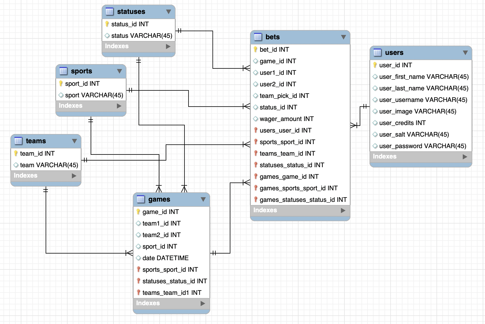

# Head to Head Wagers
## Group W: Final Project

### Team Members
Joey Brefka  
Joonwoo Lee  
Colin Scanlon  

### Project Pages
Pages   | Status | Wireframe
------- | ------ | ---------
Login   | 100%    | [wireframe]()
Account | 100%    | [wireframe]()
Admin   | 100%    | [wireframe]()
Browse  | 100%    | [wireframe]()
Create  | 100%    | [wireframe]()
History | 100%    |
Pending Wager | 100% | 
Accepted Wager | 100% |

### API Routes
Method   | Route                         | Description
-------- | ----------------------------- | ---------
`POST`   | `/login`                      | Receives an email and password
`POST`   | `/register`                   | Creates a new user account and returns the new user object
`GET`    | `/users`                      | Retrieves an array of all active users in the system
`GET`    | `/users/:userId`              | Retrieves a user by its Id
`GET`    | `/bets/:betId`                | Retrieves a bet by its Id
`POST`   | `/bets`                       | Creates a new bet and returns the new bet object
`POST`   | `/activeBet  `                | Creates a new accepted bet and returns the new accepted bet object
`GET`    | `/users/:userId/bets`         | Retrieves a list of users bets
`GET`    | `/users/:userId/bets/:active` | Retrieves a list of users active bets
`GET`    | `/games`                      | Retrieves a list of all games in the system
`GET`    | `/games/gameId`               | Retrieves a game by its id
`GET`    | `/games/:gameId/bets`         | Retireves a list of all bets for a game 
`GET`    | `/basketballGames`            | Retrieves a list of basketball games 
`GET`    | `/soccerGames`                | Retrieves a list of soccer games 
`GET`    | `/footballGames`              | Retrieves a list of football games 
`GET`    | `/availableBets`              | Retrieves a list of all available bets 
`GET`    | `/availableBets/bet/:id`      | Retrieves an available bet by its id
`GET`    | `/teams/:teamId`              | Retrieves a team by its id
`PUT`    | `/users/:userId/balance`      | Edits the balance of a user to reflect bets 
`DELETE` | `/users/:userId`              | Deletes a user with the given Id 
`DELETE` | `/users/:userId/bets/:betId`  | Deletes a users bet with the given Id 

### Database ER

### Team Tasks
#### Project Proposal 
Task | Owner | Status | Comments
-----|-------|--------|--------
Wireframes | Joonwoo | Completed | -
Proposal Write-Up | Colin | Completed | -
Screencast | Colin | Completed | -
Draft Wireframes | Joey | Completed | - 
Proposal Write-Up | Joey | Completed | -

#### Milestone 1
Task | Owner | Status | Comments
-----|-------|--------|--------
Backend: server.js set up | Colin | Completed | -
Backend: APIRouter.js | Colin | Completed | -
Frontend: Create page | Joonwoo | Completed | -
Frontend: Account page | Joonwoo | Completed | -
Frontend: Login page | Joey | Completed | -
Frontend: Browse page | Joey | Completed | -
Frontend: Admin page | Joey | Completed | -
Screencast | Joey | Completed | -

#### Milestone 2
Task | Owner | Status | Comments
-----|-------|--------|--------
Frontend: Create page | Joonwoo | Completed | -
Frontend: Account page | Joonwoo | Completed | -
Login | Joonwoo | Completed | -
Database Schema | Colin | Completed | - 
DB Modules | Colin | Completed | - 
Database DAO Files | Colin | Completed | - 
Backend API Routes | Colin | In Progress | -
Frontend: Browse page | Joey | Completed | -
Frontend: Admin page | Joey | In Progress | -
Screencast | Joey | Completed | -

#### Final Project
Task | Owner | Status | Comments
-----|-------|--------|--------
Documentation | Colin | Completed | -

### Features 
What works (description of your features) and what doesn't work (any known issues)
Users can create bets, accept proposed bets, and view a list of games to bet on. (View bet history is currently reporting errors)

### User Authentication 
A brief description of your authentication and authorization processes. What techniques are you using? What data is being stored where and how? How are you making sure users only access what they are allowed to?
Users authenticate through the use of hashs and salts to ensure plain text paswords are never saved in the system 

### Offline functionality
A list of all the pages in your app, how to navigate them, and the offline functionality they provide, if any
Because accepting bets and wagering is time sensitive and involves money, the user is not able to access most of the system while offline to ensure 

### Caching Strategy 
A description of your caching strategy and why you chose it

