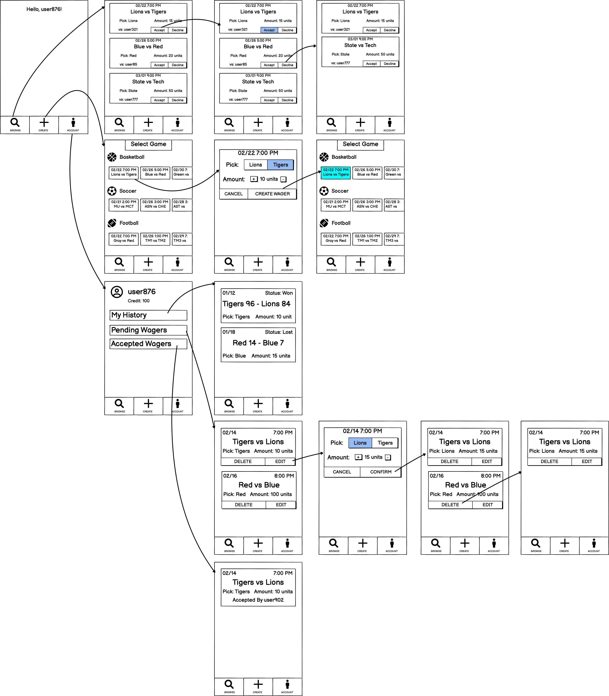

# Head to Head Wagers Proposal
Sports betting has quickly grown to be a multi-billion dollar industry in the US. With over 47 million Americans set to place at least one bet in this year’s NFL season, sports betting has become an avid part of many sports fans' viewing experience. Sports betting is on pace to eclipse 7 billion dollars in revenue by 2025 at the expense of American consumers. Our proposed PWA aims to combat the age-old saying, “The house always wins.” Rather than betting against a sportsbook, users will be able to place bets directly against other users eliminating the advantage that sportsbooks have over the users. As sports betting continues to grow, we hope to provide a better alternative for sporting fans to participate in.

In traditional sports betting one must place a bet against a sportsbook. These sportsbooks give bettors disadvantageous odds to ensure that over time the sportsbook will profit. Our PWA would change this. Instead of partaking in a system that is practically guaranteed to make you lose, sports fans around the world could place wagers directly against other fans.
One of the main appeals of the app is the ability to interact directly with other fans. Users would be able to develop playful rivalries with other users. There would be potential to develop an online community through a shared interest in sports.

The app has two main features for users as can be seen in the wireframes below, creating wagers and accepting wagers from other users. A user can create a wager by selecting the game they want, then pick a team to win, and last they choose the amount they are wagering. Once they have done this they click “Create Wager.” This wager becomes available for other users to accept. 

A user can find wagers to accept in the “Browse” tab. This displays a list of available wagers that have been created by other users. If the user finds one that they would like to accept they can press the “accept” button. The wager is then confirmed and no other user can accept it and the user who created it can no longer delete it. Our current wireframes show this tab simply listing the available wagers. This is how we plan to implement it initially, however, we have ideas of how to make this better. We could potentially add the ability to filter results by different criteria such as sport or wager amount. 

## Wireframes 

## Team Members' Contributions

Colin Scanlon - Worked on writing the proposal, screencast, and set up repository

Joey Brefka - Created rough draft wireframes as a model for the actual wireframes and worked on writing the proposal.

Joonwoo Lee - Wireframes
